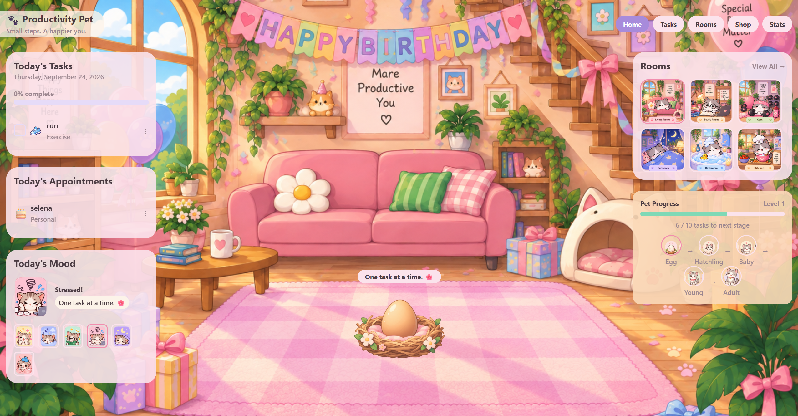
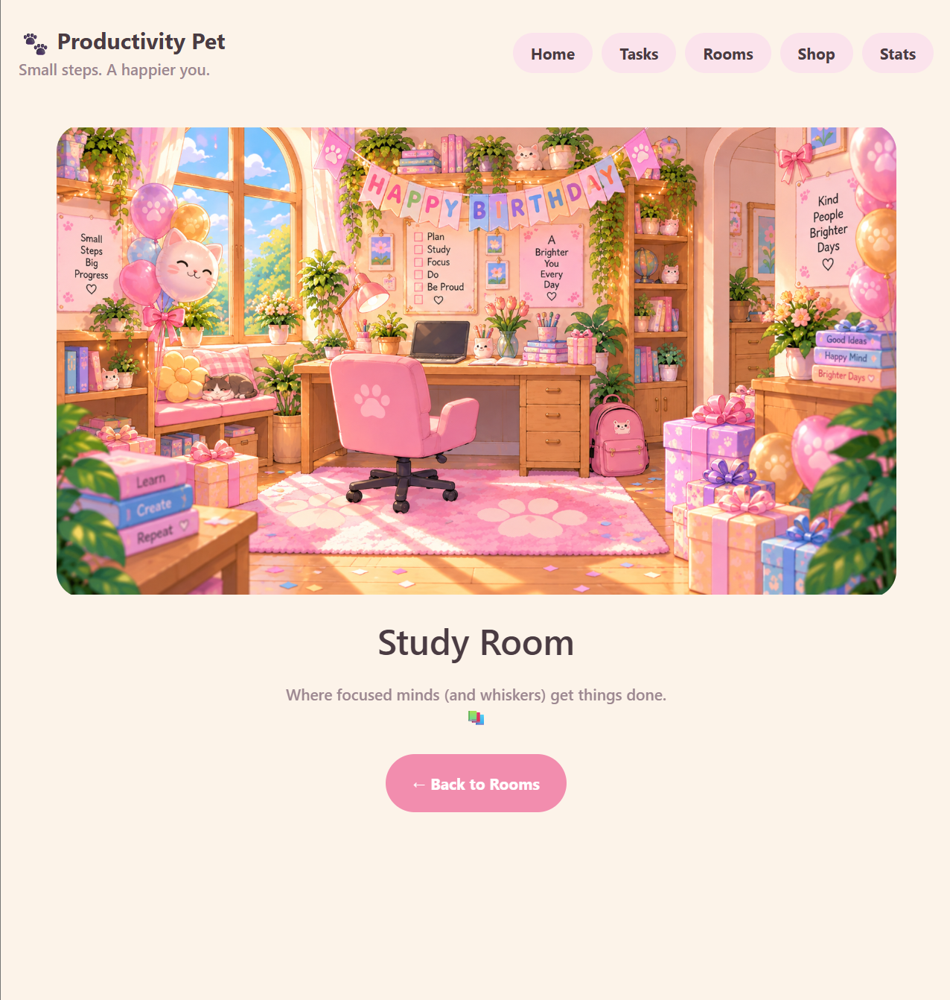
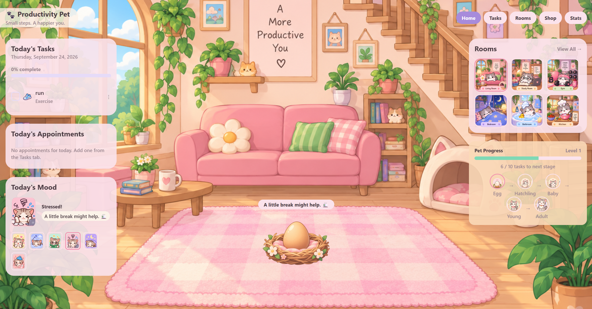

# Birthday Mode Spike Test

## Test Question / Uncertainty

Can ProductivityPet automatically recognize a birthday stored in the task/calendar system and dynamically switch the app and individual rooms to birthday-themed backgrounds without breaking the normal room/navigation system?

## Why I Chose to Test This

Birthday Mode touches a lot of different parts of the app at once — the task/calendar data, the Home screen, the Tasks screen, and all five individual rooms — but it does this without any dedicated "birthday" storage of its own. Instead, it just reads the same task data that already powers the rest of the app and reacts to it. Since this feature spans so many screens and depends on date logic working correctly, I wanted to confirm with a real manual test that the detection actually works end-to-end, that the right background shows up in the right place, and that none of the app's normal navigation breaks while it's active.

## Test Procedure

1. Set Selena's birthday task to today's date.
2. Opened Home and checked whether the birthday-themed Living Room background appeared automatically.
3. Navigated from Home into the Study Room and checked whether it also showed its birthday-themed background.
4. Continued navigating around the app (back to Rooms, back to Home, etc.) to confirm nothing was broken while Birthday Mode was active.
5. Edited Selena's birthday so the month/day no longer matched today.
6. Navigated back to Home and checked whether the normal Living Room background returned.

## Expected Result

- When today's date matches a stored birthday, Home and the individual rooms should automatically switch to their birthday-themed backgrounds.
- Navigating between screens should continue to work normally the whole time — no broken links, no crashes, no missing images.
- Once the birthday no longer matches today's date, the app should automatically switch back to its normal backgrounds without needing anything else to be changed manually.

## Actual Result

The test was successful and matched what was expected:

- After setting Selena's birthday to today's date, Home automatically displayed the birthday Living Room background.
- Opening the Study Room showed its own correct birthday-themed background.
- Navigation continued working normally the entire time Birthday Mode was active — moving between screens didn't break anything.
- After editing the birthday so the month/day was no longer today, going back to Home showed the normal Living Room background again, with no manual reset needed.

## What I Learned

This test showed that the existing birthday data can control visual changes across different parts of the app without needing a separate birthday system. The app already knows about birthdays through the regular task/calendar data, and Birthday Mode just reads that same data to decide what to display — it doesn't duplicate or store anything extra. This also showed that the special-event background approach isn't something built one-off just for birthdays — it's set up in a way that could potentially be reused later for other special events, like holiday themes for Christmas, Halloween, or Valentine's Day.

## How This Affects My Plan Going Forward

Since this test confirmed the approach works end-to-end, I plan to reuse and expand the special-event background system for holidays going forward, rather than building something new for each one. Normal backgrounds will stay the default for every screen, and each new holiday would just plug into the same pattern Birthday Mode already proved out — detect the date, then swap in the right themed background for that screen if it's active.

## Screenshots

**birthday-home-test.png**
Home screen showing the birthday-themed Living Room background after Selena's birthday was set to today's date.

**birthday-studyroom-test.png**
Study Room showing its own birthday-themed background after navigating there from Home while Birthday Mode was active.

**birthday-mode-off-test.png**
Home screen back to its normal Living Room background after the birthday date was edited so it no longer matched today.

